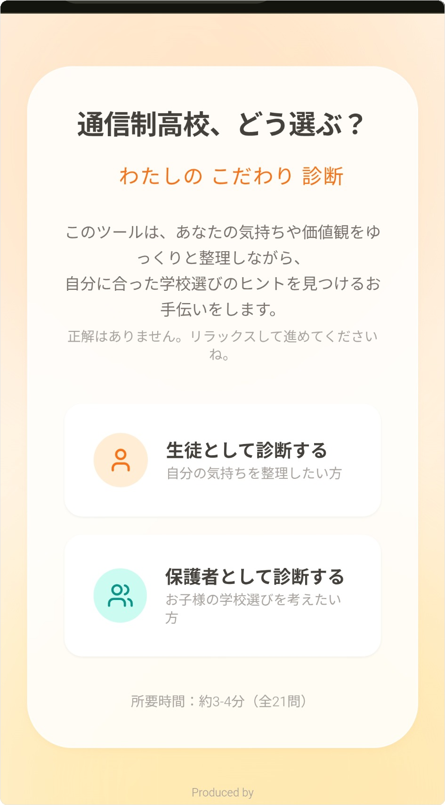
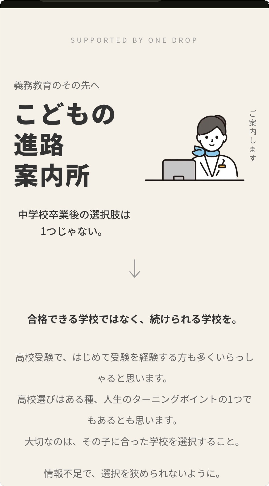
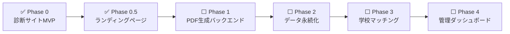

<div align="center">

# こどもの進路案内所

### 中学校卒業後の進路選択を支援する Web サービス

[](https://shindan.kodomo-shinro.jp/)
[](https://kodomo-shinro.jp/)

[](https://react.dev/)
[](https://nextjs.org/)
[](https://www.typescriptlang.org/)
[](https://tailwindcss.com/)
[](https://www.framer.com/motion/)

Supported by **[One drop](https://onedrop2025.wixsite.com/my-site-1)**（広島県東広島市）

</div>

---

## 📖 プロジェクト概要

「こどもの進路案内所」は、通信制高校をはじめとする多様な進路の選択肢を、中学生とその保護者に分かりやすく届けるためのプロジェクトです。

> 合格できる学校ではなく、**続けられる学校**を。

本リポジトリには **2つのアプリケーション** が含まれています。

| アプリ | 説明 | URL |
|--------|------|-----|
| **🎯 診断サイト** | 21問の質問で価値観・適性を可視化し、レーダーチャートとPDFレポートを生成 | [diagnosis](https://shindan.kodomo-shinro.jp/) |
| **🏠 ランディングページ** | 保護者向け総合案内。診断への導線、進路選択肢の紹介、FAQ、相談窓口 | [LP](https://kodomo-shinro.jp/) |

---

## 📸 スクリーンショット

<div align="center">

| 診断サイト | ランディングページ |
|:---:|:---:|
|  |  |

</div>

---

## ✨ 機能一覧

### 診断サイト

| 機能 | 説明 |
|------|------|
| 🎯 **診断機能** | Knockout質問 + 通常質問 + 選択式質問（計21問）で学校選びの軸を分析 |
| 📊 **レーダーチャート** | 8軸（スクーリング頻度、学費、オンライン適性など）を可視化 |
| 👨‍👩‍👧 **親子診断** | 生徒・保護者それぞれの回答を比較し、「話し合うべきポイント」を提示 |
| 📄 **PDFレポート** | 診断結果をA4形式のPDFとしてダウンロード可能 |
| 📱 **レスポンシブ** | スマートフォン、タブレット、PCに対応 |

### ランディングページ

| 機能 | 説明 |
|------|------|
| 🏫 **進路選択肢一覧** | 全日制・定時制・通信制など9種類の学校タイプをモーダルで詳細表示 |
| 💡 **不登校支援情報** | 不登校状態の場合の進路選択のポイントを解説 |
| ❓ **FAQ** | よくある質問をアコーディオンUIで表示 |
| ✨ **アニメーション** | スクロール連動フェードイン・stagger・パルスアニメーション |
| 🖥️ **スナップスクロール** | PC（768px〜）で1セクション＝1画面のスナップ切替 |
| 📱 **モバイルファースト** | モバイルでは通常スクロール、PCではフルHD最適化 |

---

## 🛠️ 技術スタック

### 診断サイト

```
React 18 ─── TypeScript ─── Vite
     │              │
     ├─ Tailwind CSS (styling)
     ├─ Recharts (radar chart)
     ├─ html2canvas + jsPDF (PDF)
     └─ React Router DOM (routing)
```

### ランディングページ

```
Next.js 14 (App Router) ─── TypeScript
     │
     ├─ Tailwind CSS (styling)
     ├─ Framer Motion (animation)
     └─ react-icons (icons)
```

---

## 📂 プロジェクト構成

```
correspondence-school-finder/
│
├── src/                          # 🎯 診断サイト（React + Vite）
│   ├── components/               #    UIコンポーネント
│   ├── data/                     #    質問データ・静的データ
│   ├── lib/                      #    診断ロジック（スコアリング等）
│   ├── pages/                    #    ページコンポーネント
│   └── types.ts                  #    TypeScript型定義
│
├── landing_page/                 # 🏠 ランディングページ（Next.js）
│   ├── src/
│   │   ├── app/                  #    App Router（page.tsx, layout.tsx）
│   │   ├── components/           #    UIコンポーネント（11個）
│   │   ├── data/                 #    FAQ・学校選択肢データ
│   │   └── lib/                  #    アニメーション設定
│   └── public/images/            #    イラスト画像アセット
│
├── netlify/functions/            # ⚡ Netlify Functions（AI診断API）
├── docs/                         # 📄 ドキュメント・仕様書
├── archive/                      # 📦 過去の開発ログ・旧ファイル
├── screenshots/                  # 📸 スクリーンショット
└── README.md                     # 📖 このファイル
```

---

## 🚀 セットアップ

### 前提条件

- **Node.js** v18 以降
- **npm** v9 以降

### 環境変数

```bash
cp .env.example .env
# .env を編集して API キーを設定
```

| 変数名 | 用途 | 必須 |
|--------|------|------|
| `GEMINI_API_KEY` | Gemini AI API キー（Netlify Functions で使用） | ✅ |

### 診断サイト

```bash
# リポジトリをクローン
git clone https://github.com/tatsunoritojo/correspondence-school-finder.git
cd correspondence-school-finder

# 依存関係をインストール
npm install

# 開発サーバーを起動
npm run dev
# → http://localhost:5173 で確認
```

### ランディングページ

```bash
cd landing_page

# 依存関係をインストール
npm install

# 開発サーバーを起動
npm run dev
# → http://localhost:3000 で確認
```

### 本番ビルド

```bash
# 診断サイト
npm run build          # → dist/ に出力

# ランディングページ
cd landing_page
npm run build          # → .next/ に出力
```

---

## 🗺️ 開発ロードマップ



| Phase | 内容 | 状態 |
|-------|------|------|
| **Phase 0** | フロントエンドMVP完成（診断サイト） | ✅ 完了 |
| **Phase 0.5** | ランディングページ作成・デプロイ | ✅ 完了 |
| **Phase 1** | PDF生成バックエンド（Spring Boot + Playwright） | ⬜ 計画中 |
| **Phase 2** | データ永続化（PostgreSQL） | ⬜ 計画中 |
| **Phase 3** | 学校マッチング機能 | ⬜ 計画中 |
| **Phase 4** | 管理ダッシュボード | ⬜ 計画中 |

---

## 📖 ドキュメント

| ドキュメント | 説明 |
|-------------|------|
| [specification-v1.0.md](./docs/specification-v1.0.md) | フロントエンド仕様書 |
| [docs/backend-specification.md](./docs/backend-specification.md) | バックエンド仕様書（Phase 1: PDF生成） |
| [docs/backend-setup-guide.md](./docs/backend-setup-guide.md) | バックエンド開発手順 |

---

## 🔗 関連リンク

| リンク | URL |
|--------|-----|
| 🎯 診断サイト | https://shindan.kodomo-shinro.jp/ |
| 🏠 ランディングページ | https://kodomo-shinro.jp/ |
| 🏢 One drop ホームページ | https://onedrop2025.wixsite.com/my-site-1 |
| 📷 One drop Instagram | https://www.instagram.com/onedrop.2025 |

---

## 📄 ライセンス

Private — All rights reserved

---

<div align="center">

Made with ❤️ for **こどもの未来**

</div>
