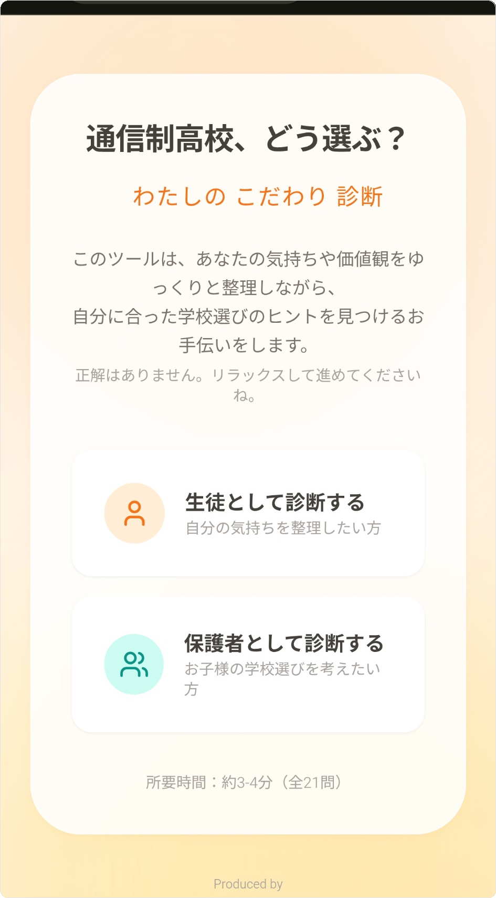
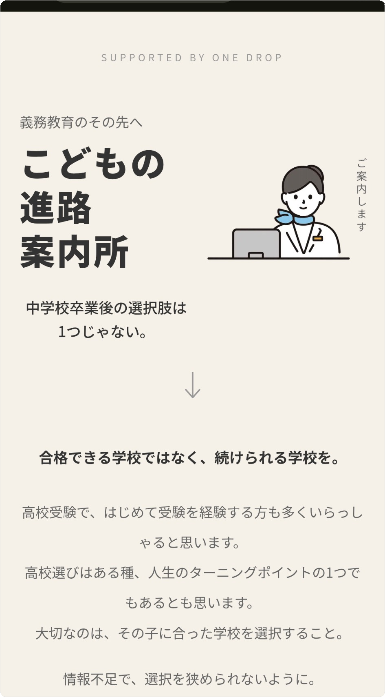

<div align="center">

# こどもの進路案内所

### 中学校卒業後の進路選択を支援する Web サービス

[](https://shindan.kodomo-shinro.jp/)
[](https://kodomo-shinro.jp/)

[](https://react.dev/)
[](https://nextjs.org/)
[](https://www.typescriptlang.org/)
[](https://tailwindcss.com/)
[](https://www.framer.com/motion/)

Supported by **[One drop](https://onedrop2025.com)**（広島県東広島市）

</div>

---

## プロジェクト概要

「こどもの進路案内所」は、通信制高校をはじめとする多様な進路の選択肢を、中学生とその保護者に分かりやすく届けるためのプロジェクトです。

> 合格できる学校ではなく、**続けられる学校**を。

本リポジトリには **2つのアプリケーション** が含まれています。

| アプリ | 説明 | URL |
|--------|------|-----|
| **診断サイト** | 21問の質問で価値観・適性を可視化し、レーダーチャートとPDFレポートを生成 | [shindan.kodomo-shinro.jp](https://shindan.kodomo-shinro.jp/) |
| **ランディングページ** | 保護者向け総合案内。診断への導線、進路選択肢の紹介、FAQ、相談窓口 | [kodomo-shinro.jp](https://kodomo-shinro.jp/) |

---

## スクリーンショット

<div align="center">

| 診断サイト | ランディングページ |
|:---:|:---:|
|  |  |

</div>

---

## 機能一覧

### 診断サイト

| 機能 | 説明 |
|------|------|
| **診断機能** | Knockout質問 + 通常質問 + 選択式質問（計21問）で学校選びの8軸を分析 |
| **レーダーチャート** | 8軸（スクーリング頻度、学費、オンライン適性、自己管理、進路志向、学校生活、メンタルヘルス、専門課程）を可視化 |
| **AI診断コメント** | Gemini API による診断結果の要約・強み・弱みコメントを自動生成 |
| **親子診断** | 生徒・保護者それぞれの回答を比較し、「話し合うべきポイント」を提示 |
| **PDFレポート** | 診断結果をA4形式のPDFとしてダウンロード |
| **結果画像保存** | レーダーチャートを画像として保存・共有 |
| **結果共有URL** | 診断結果をURLで共有可能 |
| **データ収集同意** | 同意を得た上で診断データを匿名収集 |
| **レスポンシブ** | スマートフォン、タブレット、PCに対応 |

### ランディングページ

| 機能 | 説明 |
|------|------|
| **進路選択肢一覧** | 全日制・定時制・通信制など9種類の学校タイプをモーダルで詳細表示 |
| **不登校支援情報** | 不登校状態の場合の進路選択のポイントを解説 |
| **FAQ** | よくある質問をアコーディオンUIで表示 |
| **アニメーション** | スクロール連動フェードイン・stagger・パルスアニメーション |
| **スナップスクロール** | PC（768px〜）で1セクション＝1画面のスナップ切替 |
| **モバイルファースト** | モバイルでは通常スクロール、PCではフルHD最適化 |

---

## 技術スタック

### 診断サイト

```
React 18 ─── TypeScript 5 ─── Vite 5
     │
     ├─ Tailwind CSS 3 (styling)
     ├─ Recharts (radar chart)
     ├─ html2canvas + jsPDF (PDF generation)
     ├─ React Router DOM 6 (BrowserRouter)
     └─ Gemini 2.0 Flash (AI diagnosis — via Netlify Functions)
```

### ランディングページ

```
Next.js 14 (App Router) ─── TypeScript 5
     │
     ├─ Tailwind CSS 3 (styling)
     ├─ Framer Motion 11 (animation)
     └─ react-icons (icons)
```

### インフラ

```
Netlify ──── 診断サイト (SPA) + Netlify Functions (API)
Vercel ───── ランディングページ (SSR)
Cloudflare ─ DNS管理
```

---

## プロジェクト構成

```
correspondence-school-finder/
│
├── src/                          # 診断サイト（React + Vite）
│   ├── components/               #   UIコンポーネント（9個）
│   │   ├── RadarChart.tsx        #     レーダーチャート
│   │   ├── QuestionCard.tsx      #     設問UI
│   │   ├── PrintableReport.tsx   #     PDF出力用レイアウト
│   │   ├── DataConsentForm.tsx   #     データ収集同意フォーム
│   │   ├── NameInputDialog.tsx   #     名前入力ダイアログ
│   │   ├── ReportOverlay.tsx     #     レポートオーバーレイ
│   │   ├── ResultCard.tsx        #     結果カード
│   │   └── AxisCard.tsx          #     軸カード
│   ├── data/                     #   質問・軸・定数データ
│   ├── hooks/                    #   カスタムフック
│   │   └── useTrackView.ts      #     ビューポート検知（GA4連携）
│   ├── lib/                      #   ロジック・ユーティリティ
│   │   ├── scoring.ts            #     スコア計算（8軸）
│   │   ├── gemini.ts             #     Gemini API クライアント
│   │   ├── analytics.ts          #     GA4 イベント送信
│   │   ├── storage.ts            #     LocalStorage 管理
│   │   ├── saveStrategy.ts       #     画像保存戦略（download / share）
│   │   ├── deviceDetection.ts    #     デバイス・OS検出
│   │   ├── resultApi.ts          #     結果データAPI
│   │   └── devSeed.ts            #     開発用ダミーデータ
│   ├── pages/                    #   ページコンポーネント
│   │   ├── StartPage.tsx         #     トップページ
│   │   ├── QuestionsPage.tsx     #     診断フォーム
│   │   ├── ResultPage.tsx        #     結果表示
│   │   └── DiagnosePage.tsx      #     QuestionsPage別名
│   └── types.ts                  #   TypeScript型定義
│
├── netlify/functions/            # Netlify Functions（サーバーレスAPI）
│   ├── gemini-advice.ts          #   AI診断コメント生成
│   ├── send-report.ts            #   メールレポート送信
│   ├── save-result.ts            #   診断結果保存
│   ├── get-result.ts             #   診断結果取得
│   └── collect-data.ts           #   匿名データ収集
│
├── landing_page/                 # ランディングページ（Next.js）
│   ├── src/
│   │   ├── app/                  #   App Router（page.tsx, layout.tsx）
│   │   ├── components/           #   UIコンポーネント（20+）
│   │   ├── data/                 #   FAQ・学校選択肢データ
│   │   ├── lib/                  #   アニメーション設定
│   │   └── contexts/             #   アクセシビリティContext
│   └── public/images/            #   イラスト画像アセット
│
├── backend/                      # PDFバックエンド（Spring Boot — 開発中）
├── docs/                         # ドキュメント・仕様書
├── archive/                      # 過去の開発ログ・旧ファイル
├── screenshots/                  # スクリーンショット
└── README.md                     # このファイル
```

---

## セットアップ

### 前提条件

- **Node.js** v18 以降
- **npm** v9 以降

### 環境変数

```bash
cp .env.example .env
# .env を編集して API キーを設定
```

| 変数名 | 用途 | 必須 |
|--------|------|------|
| `GEMINI_API_KEY` | Gemini AI API キー（Netlify Functions で使用） | Yes |

### 診断サイト

```bash
# リポジトリをクローン
git clone https://github.com/tatsunoritojo/correspondence-school-finder.git
cd correspondence-school-finder

# 依存関係をインストール
npm install

# 開発サーバーを起動
npm run dev
# → http://localhost:5173 で確認
```

### ランディングページ

```bash
cd landing_page

# 依存関係をインストール
npm install

# 開発サーバーを起動
npm run dev
# → http://localhost:3000 で確認
```

### 本番ビルド

```bash
# 診断サイト
npm run build          # → dist/ に出力

# ランディングページ
cd landing_page
npm run build          # → .next/ に出力
```

### テスト

```bash
npm run test           # Vitest（scoring, saveStrategy, deviceDetection）
```

---

## デプロイ

| サイト | ホスティング | ドメイン | ビルド |
|--------|-------------|----------|--------|
| 診断サイト | Netlify | `shindan.kodomo-shinro.jp` | `npm run build` → `dist/` |
| ランディングページ | Vercel | `kodomo-shinro.jp` | `npm run build` → `.next/` |

- DNS管理: Cloudflare
- ドメイン: お名前.com（`kodomo-shinro.jp`）

---

## ドキュメント

| ドキュメント | 説明 |
|-------------|------|
| [specification-v1.0.md](./docs/specification-v1.0.md) | フロントエンド仕様書 |
| [SPECIFICATION.md](./docs/SPECIFICATION.md) | 現行仕様書 |
| [backend-specification.md](./docs/backend-specification.md) | バックエンド仕様書（PDF生成） |
| [backend-setup-guide.md](./docs/backend-setup-guide.md) | バックエンド開発手順 |
| [DEPLOYMENT_GUIDE.md](./docs/DEPLOYMENT_GUIDE.md) | デプロイガイド |
| [NETWORK_GUIDE.md](./docs/NETWORK_GUIDE.md) | ネットワーク構成ガイド |
| [TECHNICAL_WHITEPAPER.md](./docs/TECHNICAL_WHITEPAPER.md) | 技術アーキテクチャ |
| [project_concept_and_scope.md](./docs/project_concept_and_scope.md) | プロジェクト構想・スコープ |

---

## 関連リンク

| リンク | URL |
|--------|-----|
| 診断サイト | https://shindan.kodomo-shinro.jp/ |
| ランディングページ | https://kodomo-shinro.jp/ |
| One drop ホームページ | https://onedrop2025.com |
| One drop Instagram | https://www.instagram.com/onedrop.2025 |

---

## ライセンス

Private — All rights reserved

---

<div align="center">

Made with ❤️ for **こどもの未来**

</div>
